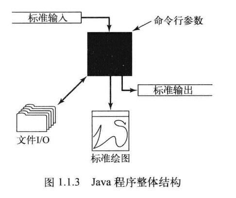

Algorithms, 4th Edition<br>
https://algs4.cs.princeton.edu/home/

# Chapter 1
## 1.1 基础编程模型

<br><br><br>

### 1.1.1 Java程序基本结构
1. execute a java code
```bash
(1) javac BinarySearch.java -> BinarySearch.class 
(2) java BinarySearch
```

<br><br><br>

### 1.1.2 primitive type
- int
- double
- boolean
- char

### 1.1.2.1 Expression
运算符 * / % 优先级高于 + 和 -

### 1.1.2.2 类型转换
如果不会损失信息，数值会被自动提升为高级的数据类型<br>
- int -> 2^32
- long -> 2^64
- short -> 2^16
- char -> 2^16
- byte -> 2^8
- float -> 2^32


<br><br><br>

### 1.1.3 statement
- declaration
- assign
- condition
- loop
- break and continue

<br><br><br>

### 1.1.4 简便记法
- 单语句代码段
- for语句
```java
for (‹initialize; ‹boolean expression›; <increment>){
    <block statements>
}

// 等价于 
initialize;
while(‹boolean expression›){
    <block statements>;
    <increment>;
}
```

<br><br><br>

### 1.1.5 数组

#### 1.1.5.3 使用数组
1. 颠倒数组元素的顺序
```java
public class revert(int[] a){
    int N = a.length;
    for (int i = 0; i < N/2; i++){
        double tmp = a[i];
        a[i] = a[N - 1 - i];
        a[N - 1 - i] = tmp;
    }
}
```

2. 点乘
```java
public class max_dot(int[] a, int[] b){
    int N = a.length;
    double[][] c =  new double[N][N];
    for (int i = 0; i < N; i++){
        for (int j = 0; j < N; j++) {
            for (int k =0; k< N; k++){
                c[i][j] += a[i][k] * b[k][j]; 
            }
                
        }
        
    }
}
```

#### 1.1.5.4 起别名
```java
// 会指向同一个地址
int[] a = new int[N];
a[i]=1234
int[] b = a
b[i]=5678
```

<br><br><br>

### 1.1.6 静态方法
1. sqrt
```java
public static double sqrt(double c) {
    if (c < 0) return Double.NaN
    double err = 1e-15;
    double t = c;
    while (Math.abs(t - c/t) > err * t)
        t = (c / t + t) / 2.0;
    return t;
}
```

2. prime number
```java
public static boolean isPrime(int N) {
    if (N < 2) return false;
    for (int i = 0; i * i <= N; i++)
        if (N % i == 0) return false;
    return true;
}
```

3. hypotenuse
```java
public static double hypotenuse(double a, double b) {
    return Math.sqrt(a * a + b * b)
}
```

4. 调和级数
```java
public static double H (int N){
    double sum = 0.0;
    for(int i = 1; i <= N; i++)
        sum += 1.0/i;
    return sum;
}


```


#### 1.1.6.2 调用静态方法
- 方法名重载
```java
Math.abs()
```

<br><br><br>

### 1.1.8 字符串
字符串是由遗传字符(char)组成的。非primitive type


#### 1.1.8.2 类型转换
```java
public class Integer
    static    int parseInt(String s)
    static String toString(int i)

public class Double
    static double parseDouble(String s)
    static String toString(double x)
```

<br><br><br>

### 1.1.9 输入输出


#### 1.1.9.1 命令和参数
- javac   -> 编译java程序
- java    -> 运行java程序
- more    -> 打印文件内容

#### 1.1.9.2 标准输出

```java
// 提示符           // 调用RandomSeq中的静态方法main()      // args[1]
%       java        RandomSeq       5                   100.0           200.0
    // 调用java                     // args[0]                          // args[2]
```

#### 1.1.9.3 格式化输出


```java
// d -> java整型10进制
// f -> float
// s -> string
// 在 % 和转换代码之间可以加入一个整数来表示转换之后的值的宽度
public class RandomSeq{
    public static void main(String[] args){
        // print N random number between (lo, hi)
        int N = Integer.parseInt(args[0]);
        double lo = Double.parseDouble(args[1]);
        double hi = Double.parseDouble(args[2]);
        for (int i = 0; i< N; i++){
            double x = StdRandom.uniform(lo, hi);
            StdOut.printf("%.2f\n", x);
        }
    }
}

System.out.printf("%14.3f\n", 3.111111);
System.out.printf("%-14.3f\n", 3.111111);
System.out.println(String.format("%14.2f\n", 2.311323));
>>         3.111
>>3.111         
>>          2.31
```

- 格式化方法
```bash
数据类型        转换代码        举例                    格式化字符串举例                转换后输出的字符串
int             d            512                        "%14d"                      "           512"
                                                        "%-14d"                     "512           "
double          f           1595.1680010754388          "%14.2f"                    "       1595.17"
                                                        "%.7f"                      "1595.1680011"
                e                                       "14.4e"                     "    1.5952e+03"
string          s           "Hello, World"              "%14s"                      "  Hello, World"
                                                        "%-14s"                     "Hello, World  "
                                                        "%14.5s"                    "         Hello"
```

#### 1.1.9.4 标准输入

```java
public class Average{
    public static void main(String[] args){
        double sum = 0.0;
        int cnt = 0;
        while (!StdIn.isEmpty()){
            sum += Stdin.readDouble();
            cnt++;
        }
        double avg = sum / cnt;
        StdOut.printf("Average is %.5f\n", avg);
    }
}
```

#### 1.1.9.5 重定向与管道
- 简单的提示符，可以将它的标准输出重定向至一个文件。
```bash
$ java RandomSeq 1000 100.0 200.0 > data.txt

```

- 我们可以重定向标准输入以使StdIn从文件而不是终端
```bash
$ java Average < data.txt
```


- 结合起来叫管道
    - 突破了输入输出流的长度限制
    - RandomSeq向输出流的末尾添加一个一个字符串
    - Average调用时，从输入流的开头删除了一个字符串
```bash
$ java RandomSeq 1000 100.0 200.0 | java Average
```

#### 1.1.9.6 基础文件的输入出处

#### 1.1.9.7 标准绘图库（基本方法）
#### 1.1.9.8 标准绘图库（控制方法）

<br><br><br>
### 1.1.10 二份查找
